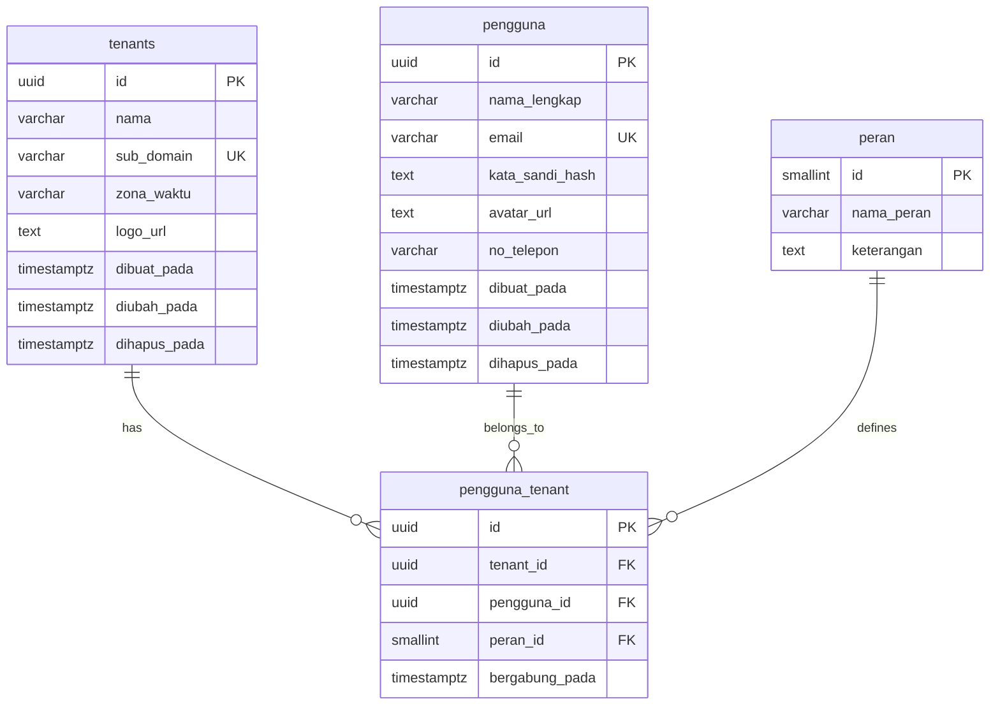
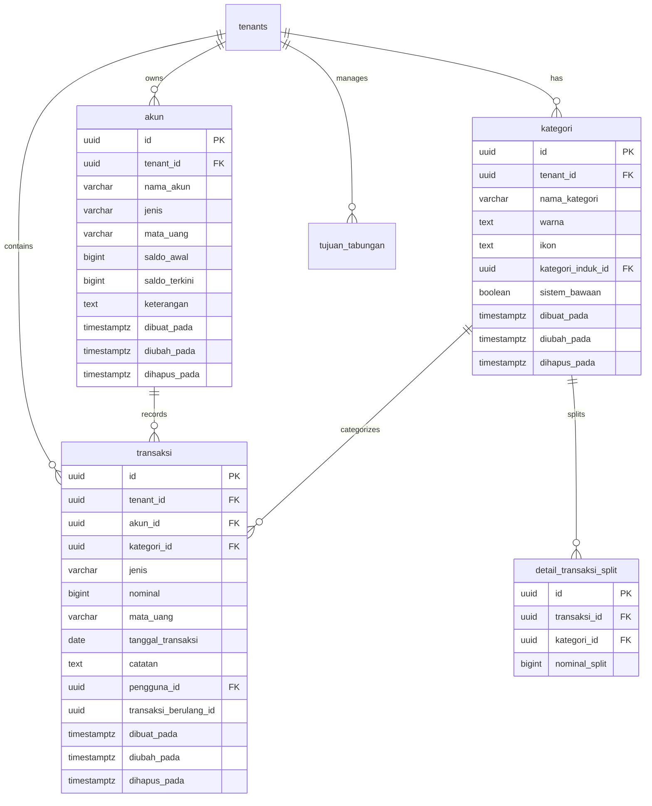
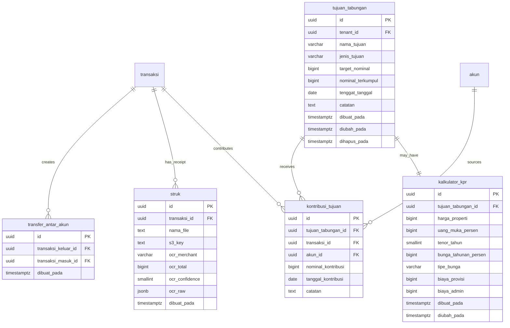
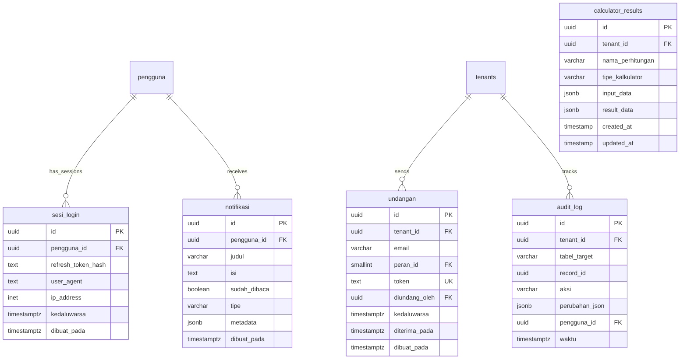

# Finora Backend - Sistem Manajemen Keuangan Pribadi

## Gambaran Umum
Finora adalah sistem manajemen keuangan pribadi yang komprehensif dibangun dengan framework **Encore.dev** menggunakan TypeScript. Sistem ini menyediakan arsitektur multi-tenant dengan kontrol akses berbasis peran, mendukung pelacakan keuangan lengkap, penganggaran, penetapan tujuan, dan perhitungan keuangan.

## 🏗️ Arsitektur
- **Framework**: Encore.dev (TypeScript)
- **Database**: PostgreSQL dengan migrasi otomatis
- **Arsitektur**: Microservices dengan komunikasi service-to-service
- **Autentikasi**: Berbasis JWT dengan refresh token
- **Multi-tenancy**: Isolasi data berbasis tenant

## 🚀 Fitur

### 1. **Autentikasi & Manajemen Pengguna**
- Registrasi dan login pengguna dengan hashing password bcrypt
- Token akses JWT dengan rotasi refresh token
- Dukungan multi-tenant dengan izin berbasis peran (Pemilik, Admin, Editor, Pembaca)
- Sistem undangan pengguna berbasis email
- Manajemen sesi dengan pelacakan perangkat
- Logging audit untuk semua tindakan pengguna

### 2. **Manajemen Akun**
- Berbagai jenis akun: Kas, Bank, E-Wallet, Kartu Kredit, Pinjaman, Aset
- Pelacakan saldo real-time dengan pembaruan otomatis
- Dukungan multi-mata uang (default: IDR)
- Riwayat akun dengan log transaksi detail
- Validasi saldo untuk transaksi pengeluaran

### 3. **Manajemen Transaksi**
- Tiga jenis transaksi: Pemasukan, Pengeluaran, Transfer
- Transaksi split dengan beberapa kategori
- Transfer antar akun dengan pelacakan transaksi berpasangan
- Transfer ke tujuan tabungan dengan pelacakan kontribusi otomatis
- Pasangan transaksi virtual untuk transfer tujuan yang tidak lengkap
- Pemrosesan struk OCR (struktur siap)
- Kemampuan impor/ekspor transaksi massal

### 4. **Manajemen Kategori**
- Struktur kategori hierarkis (hubungan parent-child)
- Kategori default sistem dengan pembuatan kategori kustom
- Kategori berkode warna dengan dukungan ikon
- Kategori khusus tenant dan sistem-wide

### 5. **Tujuan Tabungan**
- Jenis tujuan: Dana Darurat, Rumah, Kendaraan, Liburan, Pendidikan, Pensiun, Lainnya
- Pelacakan target nominal dan tenggat waktu
- Perhitungan progres otomatis
- Riwayat kontribusi dengan penautan transaksi
- Integrasi kalkulator KPR untuk tujuan rumah

### 6. **Kalkulator Keuangan**
- **Kalkulator KPR**: Perhitungan cicilan dengan jadwal amortisasi
- **Kalkulator Dana Darurat**: Rekomendasi dana darurat berdasarkan pengeluaran dan jenis pekerjaan
- **Kalkulator Pensiun**: Perencanaan pensiun dengan inflasi dan return investasi
- **Kalkulator Tujuan Kustom**: Perencanaan pencapaian tujuan fleksibel
- Simpan dan kelola riwayat perhitungan
- Ekspor hasil perhitungan

### 7. **Dashboard & Analitik**
- Gambaran keuangan real-time dengan ringkasan akun
- Pelacakan pemasukan vs pengeluaran
- Tampilan transaksi terbaru dengan pasangan transfer
- Monitoring progres tujuan
- Indikator status saldo akun

### 8. **Sistem Laporan**
- Analisis arus kas dengan perbandingan periode
- Laporan anggaran vs pengeluaran aktual
- Pelacakan kekayaan bersih dari waktu ke waktu
- Kemampuan filter dan pencarian transaksi
- Fungsi ekspor untuk analisis eksternal

### 9. **Manajemen Tenant**
- Arsitektur multi-tenant dengan isolasi data
- Pembuatan dan manajemen tenant
- Identifikasi tenant berbasis subdomain
- Dukungan timezone dan lokalisasi

## 📊 Database Schema (ERD)

### Core Entities



### Financial Entities



### Transfer & Goals



### Authentication & System



## 🏗️ Infrastruktur Sistem

### Layanan Microservices (11 Services)
| Nama Layanan | Endpoints | Database | Status |
|--------------|-----------|----------|---------|
| **akun** | 6 endpoints | ✅ Applied | 🟢 Running |
| **auth** | 6 endpoints | ✅ Applied | 🟢 Running |
| **dashboard** | 1 endpoint | - | 🟢 Running |
| **frontend** | 1 endpoint | - | 🟢 Running |
| **kalkulator** | 9 endpoints | ✅ Applied | 🟢 Running |
| **kategori** | 5 endpoints | ✅ Applied | 🟢 Running |
| **laporan** | 3 endpoints | - | 🟢 Running |
| **tenant** | 5 endpoints | ✅ Applied | 🟢 Running |
| **transaksi** | 9 endpoints | ✅ Applied | 🟢 Running |
| **tujuan** | 9 endpoints | ✅ Applied | 🟢 Running |
| **user** | 8 endpoints | - | 🟢 Running |

**Total: 62 Public Endpoints** | **7 Databases dengan Migrasi Otomatis**

### Database Server
- **Engine**: PostgreSQL dengan Docker
- **Migrasi**: Otomatis melalui Encore.dev
- **Isolasi**: Per-service database pattern
- **Status**: 🟢 Running

## 🔧 Layanan API Detail

### 1. **Layanan Auth** (`/auth`) - 6 Endpoints
- `POST /auth/register` - Registrasi pengguna
- `POST /auth/login` - Autentikasi pengguna
- `POST /auth/refresh` - Refresh token
- `POST /auth/logout` - Terminasi sesi
- `GET /auth/profile` - Dapatkan profil pengguna
- `PUT /auth/profile` - Perbarui profil pengguna

### 2. **Layanan Tenant** (`/tenant`) - 5 Endpoints
- `POST /tenant` - Buat tenant baru
- `GET /tenant` - Daftar tenant pengguna
- `GET /tenant/:id` - Dapatkan detail tenant
- `PUT /tenant/:id` - Perbarui tenant
- `DELETE /tenant/:id` - Hapus tenant

### 3. **Layanan User** (`/user`) - 8 Endpoints
- `POST /user/invite` - Kirim undangan pengguna
- `GET /user/invites` - Daftar undangan tertunda
- `POST /user/accept-invite` - Terima undangan
- `DELETE /user/invite` - Batalkan undangan
- `POST /user/invite/resend` - Kirim ulang undangan
- `GET /user/members` - Daftar anggota tenant
- `PUT /user/permission` - Perbarui izin pengguna
- `DELETE /user/member` - Hapus anggota

### 4. **Layanan Akun** (`/akun`) - 6 Endpoints
- `POST /akun` - Buat akun
- `GET /akun` - Daftar akun
- `GET /akun/:id` - Dapatkan detail akun
- `PUT /akun/:id` - Perbarui akun
- `DELETE /akun/:id` - Hapus akun
- `POST /internal/update-balance` - Perbarui saldo akun (Internal)

### 5. **Layanan Transaksi** (`/transaksi`) - 9 Endpoints
- `POST /transaksi` - Buat transaksi
- `GET /transaksi` - Daftar transaksi dengan filter
- `GET /transaksi/:id` - Dapatkan detail transaksi
- `PUT /transaksi/:id` - Perbarui transaksi
- `DELETE /transaksi/:id` - Hapus transaksi
- `POST /transaksi/transfer` - Buat transfer antar akun
- `GET /history/:akun_id` - Dapatkan riwayat transaksi akun
- `GET /transaksi/export` - Ekspor transaksi
- `GET /history/export` - Ekspor riwayat akun

### 6. **Layanan Kategori** (`/kategori`) - 5 Endpoints
- `POST /kategori` - Buat kategori
- `GET /kategori` - Daftar kategori
- `GET /kategori/:id` - Dapatkan detail kategori
- `PUT /kategori/:id` - Perbarui kategori
- `DELETE /kategori/:id` - Hapus kategori

### 7. **Layanan Tujuan** (`/tujuan`) - 9 Endpoints
- `POST /tujuan` - Buat tujuan tabungan
- `GET /tujuan` - Daftar tujuan
- `GET /tujuan/:id` - Dapatkan detail tujuan
- `PUT /tujuan/:id` - Perbarui tujuan
- `DELETE /tujuan/:id` - Hapus tujuan
- `POST /tujuan/kontribusi` - Tambah kontribusi langsung
- `GET /tujuan/:tujuan_id/kontribusi` - Daftar kontribusi tujuan
- `DELETE /tujuan/kontribusi/:id` - Hapus kontribusi
- `GET /tujuan/kontribusi` - Daftar semua kontribusi tenant

### 8. **Layanan Kalkulator** (`/kalkulator`) - 9 Endpoints
- `POST /kalkulator/kpr` - Hitung cicilan KPR
- `POST /kalkulator/dana-darurat` - Hitung dana darurat
- `POST /kalkulator/pensiun` - Hitung perencanaan pensiun
- `POST /kalkulator/custom-goal` - Hitung strategi tujuan kustom
- `POST /kalkulator/save` - Simpan hasil perhitungan
- `GET /kalkulator/saved` - Dapatkan perhitungan tersimpan
- `GET /kalkulator/saved/:id` - Dapatkan perhitungan spesifik
- `PUT /kalkulator/saved/:id` - Perbarui perhitungan tersimpan
- `DELETE /kalkulator/saved/:id` - Hapus perhitungan tersimpan

### 9. **Layanan Dashboard** (`/dashboard`) - 1 Endpoint
- `GET /dashboard/stats` - Dapatkan statistik dan gambaran dashboard

### 10. **Layanan Laporan** (`/laporan`) - 3 Endpoints
- `GET /laporan/cashflow` - Analisis arus kas
- `GET /laporan/budget-vs-actual` - Perbandingan anggaran
- `GET /laporan/net-worth` - Pelacakan kekayaan bersih

### 11. **Layanan Frontend** (`/frontend`) - 1 Endpoint
- `GET /frontend/*path` - Serve static frontend assets

## 🎯 Fitur Khusus Sistem

### Kategori Default Sistem
Sistem menyediakan 8 kategori default yang siap pakai:
- 🍽️ **Makan & Minum** - Pengeluaran makanan dan minuman
- 🚗 **Transportasi** - Biaya transportasi dan kendaraan
- 🛒 **Belanja Bulanan** - Kebutuhan rumah tangga
- 🎬 **Hiburan** - Rekreasi dan entertainment
- 🧾 **Tagihan & Listrik** - Utilitas dan tagihan rutin
- 💰 **Gaji** - Pemasukan dari pekerjaan
- 📈 **Investasi** - Pemasukan dari investasi
- ❓ **Lain-lain** - Kategori umum

### Jenis Akun yang Didukung
- 💵 **Kas** - Uang tunai
- 🏦 **Bank** - Rekening bank
- 📱 **E-Wallet** - Dompet digital (GoPay, OVO, DANA, dll)
- 💳 **Kartu Kredit** - Kartu kredit dengan limit
- 💸 **Pinjaman** - Hutang dan pinjaman
- 🏠 **Aset** - Properti dan aset berharga

### Jenis Tujuan Tabungan
- 🚨 **Dana Darurat** - Dana untuk keadaan darurat
- 🏠 **Rumah** - Tabungan untuk membeli rumah
- 🚗 **Kendaraan** - Tabungan untuk kendaraan
- ✈️ **Liburan** - Dana untuk berlibur
- 🎓 **Pendidikan** - Biaya pendidikan
- 👴 **Pensiun** - Dana pensiun
- 🎯 **Lainnya** - Tujuan kustom lainnya

### Peran Pengguna dalam Tenant
1. **Pemilik** (ID: 1) - Akses penuh, bisa hapus tenant
2. **Admin** (ID: 2) - CRUD semua data, kelola user
3. **Editor** (ID: 3) - CRUD transaksi & kategori
4. **Pembaca** (ID: 4) - Read-only access
- `POST /auth/refresh` - Refresh token
- `POST /auth/logout` - Terminasi sesi
- `GET /auth/profile` - Dapatkan profil pengguna
- `PUT /auth/profile` - Perbarui profil pengguna

### 2. **Layanan Tenant** (`/tenant`)
- `POST /tenant` - Buat tenant baru
- `GET /tenant` - Daftar tenant pengguna
- `GET /tenant/:id` - Dapatkan detail tenant
- `PUT /tenant/:id` - Perbarui tenant
- `DELETE /tenant/:id` - Hapus tenant

### 3. **Layanan User** (`/user`)
- `POST /user/invite` - Kirim undangan pengguna
- `GET /user/invites` - Daftar undangan tertunda
- `POST /user/accept-invite` - Terima undangan
- `GET /user/members` - Daftar anggota tenant
- `PUT /user/permission` - Perbarui izin pengguna
- `DELETE /user/member/:id` - Hapus anggota

### 4. **Layanan Akun** (`/akun`)
- `POST /akun` - Buat akun
- `GET /akun` - Daftar akun
- `GET /akun/:id` - Dapatkan detail akun
- `PUT /akun/:id` - Perbarui akun
- `DELETE /akun/:id` - Hapus akun
- `POST /akun/update-balance` - Perbarui saldo akun

### 5. **Layanan Transaksi** (`/transaksi`)
- `POST /transaksi` - Buat transaksi
- `GET /transaksi` - Daftar transaksi dengan filter
- `GET /transaksi/:id` - Dapatkan detail transaksi
- `PUT /transaksi/:id` - Perbarui transaksi
- `DELETE /transaksi/:id` - Hapus transaksi
- `POST /transaksi/transfer` - Buat transfer antar akun
- `GET /transaksi/history/:akun_id` - Dapatkan riwayat transaksi akun
- `GET /transaksi/export` - Ekspor transaksi

### 6. **Layanan Kategori** (`/kategori`)
- `POST /kategori` - Buat kategori
- `GET /kategori` - Daftar kategori
- `GET /kategori/:id` - Dapatkan detail kategori
- `PUT /kategori/:id` - Perbarui kategori
- `DELETE /kategori/:id` - Hapus kategori

### 7. **Layanan Tujuan** (`/tujuan`)
- `POST /tujuan` - Buat tujuan tabungan
- `GET /tujuan` - Daftar tujuan
- `GET /tujuan/:id` - Dapatkan detail tujuan
- `PUT /tujuan/:id` - Perbarui tujuan
- `DELETE /tujuan/:id` - Hapus tujuan
- `POST /tujuan/:id/kontribusi` - Tambah kontribusi ke tujuan

### 8. **Layanan Kalkulator** (`/kalkulator`)
- `POST /kalkulator/kpr` - Hitung cicilan KPR
- `POST /kalkulator/dana-darurat` - Hitung dana darurat
- `POST /kalkulator/pensiun` - Hitung perencanaan pensiun
- `POST /kalkulator/custom-goal` - Hitung strategi tujuan kustom
- `POST /kalkulator/save` - Simpan hasil perhitungan
- `GET /kalkulator/saved` - Dapatkan perhitungan tersimpan
- `PUT /kalkulator/saved/:id` - Perbarui perhitungan tersimpan
- `DELETE /kalkulator/saved/:id` - Hapus perhitungan tersimpan

### 9. **Layanan Dashboard** (`/dashboard`)
- `GET /dashboard/stats` - Dapatkan statistik dan gambaran dashboard

### 10. **Layanan Laporan** (`/laporan`)
- `GET /laporan/cashflow` - Analisis arus kas
- `GET /laporan/budget-vs-actual` - Perbandingan anggaran
- `GET /laporan/net-worth` - Pelacakan kekayaan bersih

## 💾 Penyimpanan Data

### Penanganan Mata Uang
- Semua nilai moneter disimpan sebagai **BIGINT dalam sen** (contoh: Rp 1.000 = 100000 sen)
- Konversi otomatis antara format tampilan dan penyimpanan
- Mencegah masalah presisi floating-point
- Default mata uang: IDR (Indonesian Rupiah)

### Soft Delete
- Sebagian besar entitas menggunakan timestamp `dihapus_pada` untuk soft deletion
- Mempertahankan integritas data dan audit trail
- Memungkinkan pemulihan data jika diperlukan
- Tidak mengganggu referential integrity

### Trigger Otomatis
- **Pembaruan Saldo**: Pembaruan saldo akun otomatis saat perubahan transaksi
- **Progres Tujuan**: Pembaruan progres tujuan otomatis saat kontribusi
- **Timestamp**: Pembaruan `diubah_pada` otomatis saat modifikasi record
- **Audit Trail**: Pencatatan otomatis semua perubahan data

### Database per Service
- **akun**: Manajemen akun dan saldo
- **auth**: Sesi login, undangan, notifikasi, audit log
- **kalkulator**: Hasil perhitungan tersimpan
- **kategori**: Kategori sistem dan custom
- **tenant**: Tenant, pengguna, peran, relasi
- **transaksi**: Transaksi, transfer, struk OCR
- **tujuan**: Tujuan tabungan, kontribusi, KPR calculator

## 🔒 Fitur Keamanan

### Autentikasi
- Hashing password bcrypt dengan salt
- Token akses JWT (berumur pendek)
- Rotasi refresh token untuk keamanan
- Pelacakan sesi dengan informasi perangkat

### Otorisasi
- Kontrol akses berbasis peran (RBAC)
- Isolasi data berbasis tenant
- Perlindungan endpoint API
- Izin tingkat resource

### Perlindungan Data
- Validasi dan sanitasi input
- Pencegahan SQL injection melalui parameterized queries
- Perlindungan XSS
- Rate limiting (tingkat framework)

## 🚀 Memulai

### Prasyarat
- Node.js 18+ atau Bun
- PostgreSQL 14+
- Encore CLI

### Instalasi
```bash
# Install Encore CLI
curl -L https://encore.dev/install.sh | bash

# Clone dan setup
git clone <repository>
cd finora-backend-zh3i/backend

# Install dependencies
bun install

# Jalankan migrasi database
encore db migrate

# Mulai development server
encore run
```

### Setup Environment
```bash
# Setup database (Encore menangani ini secara otomatis)
encore db create finora-backend-zh3i

# Jalankan aplikasi
encore run
```

## 📈 Optimisasi Performa

### Indeks Database
- Indeks komposit pada kolom yang sering di-query
- Partisi berbasis tenant untuk dataset besar
- Query yang dioptimalkan untuk listing dan filtering transaksi

### Strategi Caching
- Caching tingkat service untuk data yang sering diakses
- Database connection pooling
- Query SQL yang dioptimalkan dengan indexing yang tepat

### Skalabilitas
- Arsitektur microservices untuk horizontal scaling
- Pola database per service
- Desain service stateless

## 🔄 Logika Bisnis

### Alur Transaksi
1. **Validasi**: Nominal, saldo akun, field yang diperlukan
2. **Transaksi Database**: Operasi atomik dengan kemampuan rollback
3. **Pembaruan Saldo**: Penyesuaian saldo akun otomatis
4. **Audit Trail**: Pelacakan riwayat transaksi lengkap

### Logika Transfer
- Membuat transaksi berpasangan (keluar + masuk)
- Menangani transfer ke tujuan tabungan sebagai kontribusi
- Pembuatan transaksi virtual untuk transfer tujuan yang tidak lengkap
- Mempertahankan integritas referensial melalui tabel `transfer_antar_akun`

### Kontribusi Tujuan
- Perhitungan progres otomatis
- Penautan transaksi untuk audit trail
- Dukungan untuk kontribusi parsial dan berlebih
- Integrasi dengan sistem transfer

## 📊 Monitoring & Logging

### Sistem Audit
- Audit trail lengkap untuk semua modifikasi data
- Pelacakan tindakan pengguna
- Riwayat perubahan dengan JSON diff
- Isolasi audit tingkat tenant

### Penanganan Error
- Pesan error yang komprehensif
- Rollback transaksi saat kegagalan
- Degradasi yang graceful
- Response error yang terstruktur

## 🔮 Pengembangan Masa Depan

### Fitur yang Direncanakan
- **Pemrosesan Struk OCR**: Pembuatan transaksi otomatis dari struk
- **Transaksi Berulang**: Transaksi periodik otomatis
- **Manajemen Anggaran**: Pembuatan dan pelacakan anggaran
- **Pelacakan Investasi**: Manajemen portofolio
- **Aplikasi Mobile**: Aplikasi pendamping React Native
- **Analitik Lanjutan**: Wawasan dan prediksi bertenaga ML
- **Integrasi Bank**: Koneksi API open banking
- **Multi-mata uang**: Konversi dan pelacakan mata uang lanjutan

### Peningkatan Teknis
- **Update Real-time**: Integrasi WebSocket untuk update langsung
- **Caching Lanjutan**: Integrasi Redis untuk performa
- **Penyimpanan File**: Integrasi S3 untuk struk dan dokumen
- **Sistem Notifikasi**: Notifikasi email dan push
- **API Rate Limiting**: Rate limiting dan throttling lanjutan
- **Ekspor Data**: Format ekspor lanjutan dan penjadwalan

---

**Dibangun dengan ❤️ menggunakan framework Encore.dev**