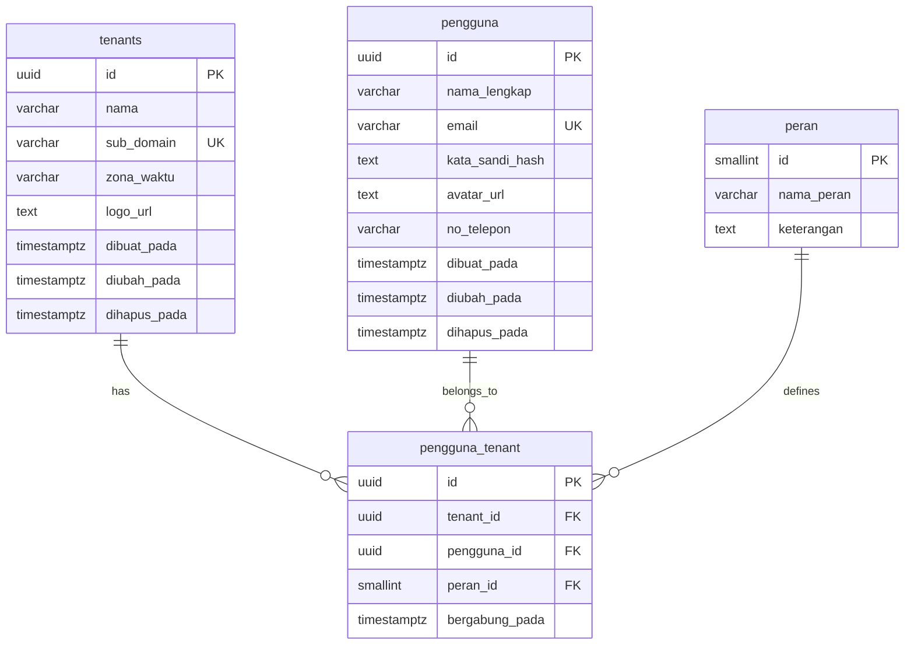
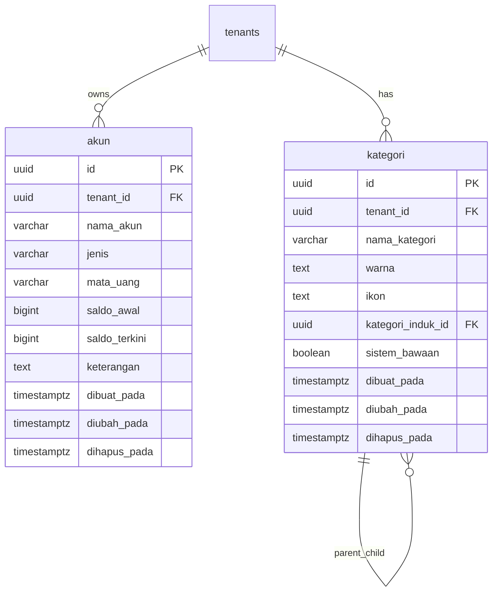
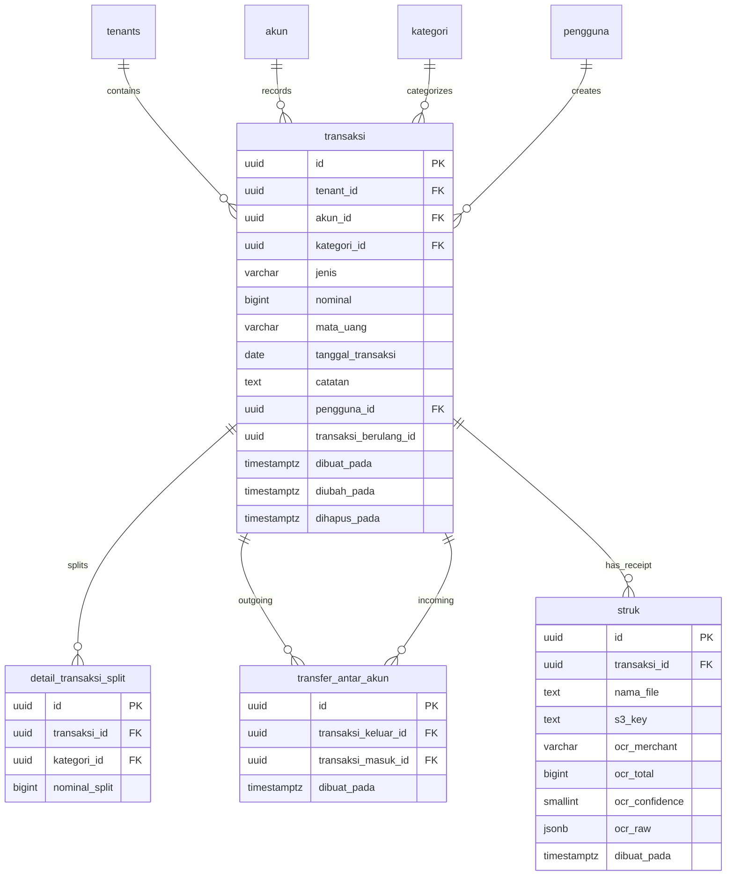
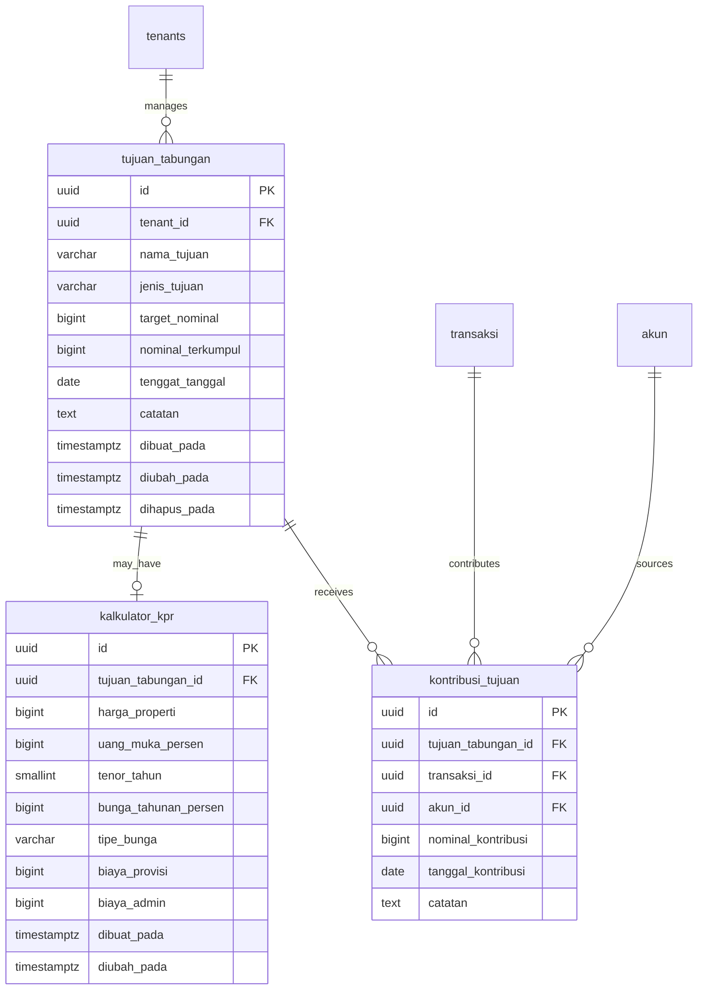
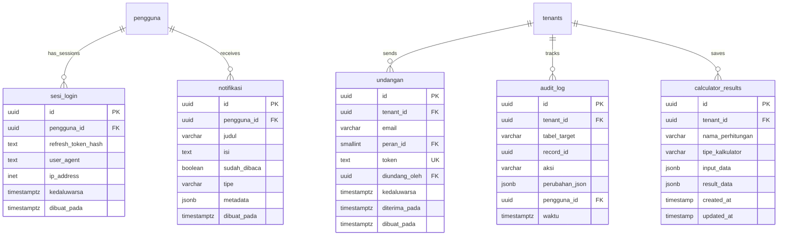

# Finora Backend - API Microservices

## Gambaran Umum
Backend API untuk sistem manajemen keuangan pribadi yang dibangun dengan **Encore.dev** menggunakan TypeScript. Menyediakan arsitektur microservices dengan 11 layanan dan 62 endpoint API.

## 🏗️ Arsitektur
- **Framework**: Encore.dev (TypeScript)
- **Database**: PostgreSQL dengan migrasi otomatis
- **Arsitektur**: Microservices dengan komunikasi service-to-service
- **Autentikasi**: JWT dengan refresh token
- **Multi-tenancy**: Isolasi data berbasis tenant

## 🚀 Layanan Microservices

### Infrastruktur (11 Services)
| Layanan | Endpoints | Database | Deskripsi |
|---------|-----------|----------|-----------|
| **akun** | 6 | ✅ | Manajemen akun keuangan |
| **auth** | 6 | ✅ | Autentikasi & sesi |
| **dashboard** | 1 | - | Statistik dashboard |
| **frontend** | 1 | - | Static assets |
| **kalkulator** | 9 | ✅ | Kalkulator keuangan |
| **kategori** | 5 | ✅ | Manajemen kategori |
| **laporan** | 3 | - | Laporan keuangan |
| **tenant** | 5 | ✅ | Manajemen tenant |
| **transaksi** | 9 | ✅ | Transaksi keuangan |
| **tujuan** | 9 | ✅ | Tujuan tabungan |
| **user** | 8 | - | Manajemen pengguna |

**Total: 62 Public Endpoints | 7 Databases**

## 🔧 API Endpoints

### Auth Service (`/auth`)
- `POST /auth/register` - Registrasi pengguna
- `POST /auth/login` - Login pengguna
- `POST /auth/refresh` - Refresh token
- `POST /auth/logout` - Logout
- `GET /auth/profile` - Profil pengguna
- `PUT /auth/profile` - Update profil

### Akun Service (`/akun`)
- `POST /akun` - Buat akun
- `GET /akun` - List akun
- `GET /akun/:id` - Detail akun
- `PUT /akun/:id` - Update akun
- `DELETE /akun/:id` - Hapus akun
- `POST /internal/update-balance` - Update saldo (Internal)

### Transaksi Service (`/transaksi`)
- `POST /transaksi` - Buat transaksi
- `GET /transaksi` - List transaksi
- `GET /transaksi/:id` - Detail transaksi
- `PUT /transaksi/:id` - Update transaksi
- `DELETE /transaksi/:id` - Hapus transaksi
- `POST /transaksi/transfer` - Transfer antar akun
- `GET /history/:akun_id` - Riwayat akun
- `GET /transaksi/export` - Export transaksi
- `GET /history/export` - Export riwayat

### Tujuan Service (`/tujuan`)
- `POST /tujuan` - Buat tujuan
- `GET /tujuan` - List tujuan
- `GET /tujuan/:id` - Detail tujuan
- `PUT /tujuan/:id` - Update tujuan
- `DELETE /tujuan/:id` - Hapus tujuan
- `POST /tujuan/kontribusi` - Tambah kontribusi
- `GET /tujuan/:id/kontribusi` - List kontribusi
- `DELETE /tujuan/kontribusi/:id` - Hapus kontribusi
- `GET /tujuan/kontribusi` - All kontribusi

### Kalkulator Service (`/kalkulator`)
- `POST /kalkulator/kpr` - Kalkulator KPR
- `POST /kalkulator/dana-darurat` - Dana darurat
- `POST /kalkulator/pensiun` - Perencanaan pensiun
- `POST /kalkulator/custom-goal` - Tujuan custom
- `POST /kalkulator/save` - Simpan hasil
- `GET /kalkulator/saved` - List tersimpan
- `GET /kalkulator/saved/:id` - Detail tersimpan
- `PUT /kalkulator/saved/:id` - Update tersimpan
- `DELETE /kalkulator/saved/:id` - Hapus tersimpan

### Kategori Service (`/kategori`)
- `POST /kategori` - Buat kategori
- `GET /kategori` - List kategori
- `GET /kategori/:id` - Detail kategori
- `PUT /kategori/:id` - Update kategori
- `DELETE /kategori/:id` - Hapus kategori

### Tenant Service (`/tenant`)
- `POST /tenant` - Buat tenant
- `GET /tenant` - List tenant
- `GET /tenant/:id` - Detail tenant
- `PUT /tenant/:id` - Update tenant
- `DELETE /tenant/:id` - Hapus tenant

### User Service (`/user`)
- `POST /user/invite` - Undang pengguna
- `GET /user/invites` - List undangan
- `POST /user/accept-invite` - Terima undangan
- `DELETE /user/invite` - Batalkan undangan
- `POST /user/invite/resend` - Kirim ulang
- `GET /user/members` - List anggota
- `PUT /user/permission` - Update permission
- `DELETE /user/member` - Hapus anggota

### Dashboard Service (`/dashboard`)
- `GET /dashboard/stats` - Statistik dashboard

### Laporan Service (`/laporan`)
- `GET /laporan/cashflow` - Laporan arus kas
- `GET /laporan/budget-vs-actual` - Budget vs aktual
- `GET /laporan/net-worth` - Kekayaan bersih

### Frontend Service (`/frontend`)
- `GET /frontend/*path` - Static assets

## 💾 Database Schema (ERD)

### Core Tenant & User Management


### Financial Core (Akun & Kategori)


### Transaction Management


### Goals & Contributions


### Authentication & System


## 🔒 Keamanan

### Autentikasi
- bcrypt password hashing
- JWT access tokens (15 min)
- Refresh tokens (30 days)
- Session tracking

### Otorisasi
- Role-based access control
- Tenant data isolation
- API endpoint protection
- Resource-level permissions

### Data Protection
- Input validation & sanitization
- SQL injection prevention
- XSS protection
- Rate limiting

## 🚀 Setup & Development

### Prasyarat
- Node.js 18+ atau Bun
- PostgreSQL 14+
- Encore CLI

### Instalasi
```bash
# Install Encore CLI
curl -L https://encore.dev/install.sh | bash

# Install dependencies
bun install

# Setup database
encore db create finora-backend-zh3i

# Run migrations
encore db migrate

# Start development
encore run
```

### Environment
```bash
# Database otomatis dihandle Encore
# API tersedia di http://localhost:4000
```

## 📊 Fitur Utama

### Multi-tenant Architecture
- Isolasi data per tenant
- Role-based access (Pemilik, Admin, Editor, Pembaca)
- Subdomain identification

### Financial Management
- 6 jenis akun (Kas, Bank, E-Wallet, Kartu Kredit, Pinjaman, Aset)
- 3 jenis transaksi (Pemasukan, Pengeluaran, Transfer)
- **Debt Account Logic**: Pinjaman & Kartu Kredit dengan validasi khusus
  - Saldo negatif = utang
  - ❌ Tidak bisa jadi sumber transfer/kontribusi
  - ✅ Bisa jadi tujuan transfer (pembayaran)
  - ❌ Hanya bisa pengeluaran (menambah utang)
  - ✅ Transfer masuk = pembayaran utang
- Real-time balance tracking
- Multi-currency support (default IDR)

### Advanced Features
- Split transactions
- Goal tracking dengan progress
- Financial calculators (KPR, Dana Darurat, Pensiun, Custom)
- **Net Worth Calculation**: Aset - Utang otomatis
- **Debt Management**: Pelacakan utang terpisah dari aset
- **Accurate Reporting**: Laporan mengecualikan transaksi akun utang dari cashflow
- Comprehensive reporting
- Data export capabilities

### System Features
- Soft delete dengan audit trail
- Automatic balance updates
- Transaction pairing untuk transfers
- OCR receipt processing (ready)

## 🔄 Business Logic Relationships

### Transfer Flow
1. **Account-to-Account Transfer**:
   - Membuat transaksi berpasangan (keluar + masuk)
   - Menghubungkan melalui tabel `transfer_antar_akun`
   - Memperbarui saldo kedua akun

2. **Account-to-Goal Transfer**:
   - Membuat transaksi keluar dari akun
   - Membuat transaksi masuk ke tujuan (virtual akun_id = tujuan_id)
   - Membuat record `kontribusi_tujuan`
   - Memperbarui saldo akun dan progress tujuan

3. **Direct Goal Contribution**:
   - Membuat record transaksi
   - Membuat record `kontribusi_tujuan` dengan akun_id
   - Memperbarui saldo akun dan progress tujuan

### Data Consistency
- **Soft Delete**: Semua entitas utama menggunakan timestamp `dihapus_pada`
- **Audit Trail**: Semua perubahan dicatat dalam `audit_log`
- **Balance Sync**: Saldo akun diperbarui melalui trigger dan API calls
- **Goal Progress**: Dihitung otomatis dari record `kontribusi_tujuan`

## 🔄 Business Logic

### Transaction Flow
1. Validasi (jumlah, saldo, field wajib)
2. Transaksi database (operasi atomik)
3. Pembaruan saldo (otomatis)
4. Audit trail (riwayat lengkap)

### Transfer Logic
- Transaksi berpasangan (keluar + masuk)
- Penanganan kontribusi tujuan
- Transaksi virtual untuk transfer tidak lengkap
- Integritas referensial melalui transfer_antar_akun

### Goal Contributions
- Perhitungan progress otomatis
- Penautan transaksi untuk audit
- Dukungan kontribusi parsial dan berlebih
- Integrasi sistem transfer

## 📈 Performance

### Database Optimization
- Indeks komposit pada kolom yang sering diquery
- Partisi berbasis tenant
- Query yang dioptimalkan untuk listing/filtering

### Caching Strategy
- Caching tingkat layanan
- Connection pooling database
- Query SQL yang dioptimalkan

### Scalability
- Arsitektur microservices
- Pola database-per-service
- Desain layanan stateless

## 🔮 Future Development

### Planned Features
- Pemrosesan struk OCR
- Transaksi berulang
- Manajemen anggaran
- Pelacakan investasi
- Dukungan aplikasi mobile
- Analitik bertenaga ML
- Integrasi open banking

### Technical Improvements
- Pembaruan real-time (WebSocket)
- Caching lanjutan (Redis)
- Penyimpanan file (S3)
- Notifikasi push
- Rate limiting lanjutan
- Ekspor terjadwal

---

**Dibangun dengan ❤️ menggunakan framework Encore.dev**